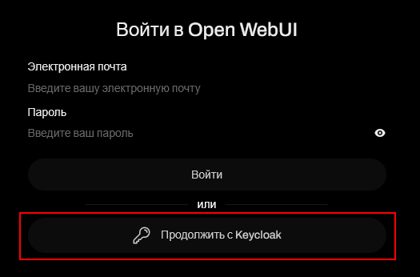

# Gemini (версия Pro)

<small>_**Статус:** ✓ Используем в работе_</small>

Сервис является одной из крупнейших языковых моделей, используемой в качестве корпоративного AI-инструмента.

## Доступ

> **URL:** [https://ai.ipiton.ru/](https://ai.ipiton.ru/)
>
> **Авторизация:** Кнопка «Продолжить с Keycloak» → авторизация через учетную запись пользователя в компании (`Ivanov_ai`, пароль).

{width=300}

<figcaption style="color: #666; font-size: 0.9em; margin-top: 8px;">Доступ в сервис</figcaption>

## Сценарии использования



- Используем в работе

  | **Сценарий** | **Описание** |
  |:---|:---|
  [Анализ и документирование кода](./scenario-code.md) | Анализ кода 1С, генерация документации, тестов и ТЗ |
  [Оценка готового ТЗ](./scenario-review.md) | Рецензирование ТЗ, объективная обратная связь |
  [Доработка ТЗ. Анализ рисков](./scenario-improve.md) | Уточняющие вопросы, проработка рисков |
  [Разработка ТЗ](./scenario-develop.md) | Помощь в написании ТЗ |
  
- Не используем в работе

  | **Сценарий** | **Причина** |
  |:---|:---|
  [Оценка трудоемкости](./scenario-estimate.md) | Неточность из-за нехватки контекста |
  [Работа с блок-схемами](./scenario-flowchart.md) | Только для простых процессов |


